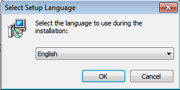
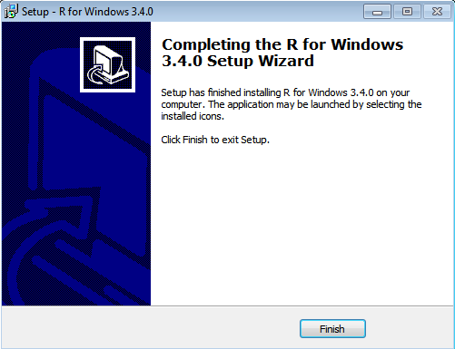
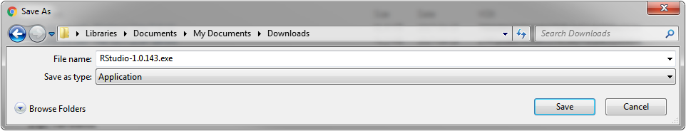
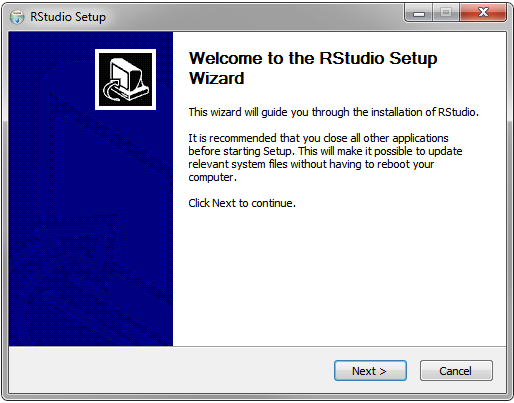
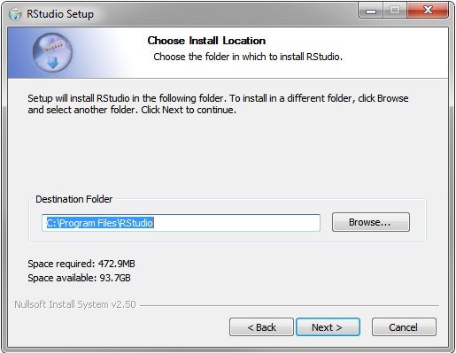
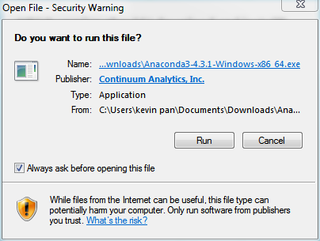
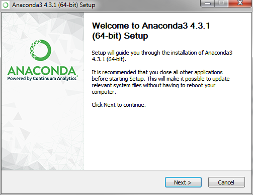
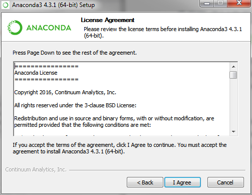

Module 0: Setup
===============

Install R and RStudio
---------------------

- **R** is a software environment for statistical computing and graphics. 
Download the appropriate version at: [https://cran.rstudio.com/](https://cran.rstudio.com/)

- **RStudio** makes R easier to use. It includes a code editor, debugging & visualization tools.
Download the appropriate version for your platform at: [https://www.rstudio.com/products/rstudio/download2/](https://www.rstudio.com/products/rstudio/download2/)

### Installing R
Installing R: 

1. Go to: https://cran.rstudio.com.
2. Click “Download R 3.x.x for [Windows or OS X]”.
3. Save the latest installer file or package binary (e.g. 3.4.0).
4. Open the installer from where it was downloaded.
5. Click “Run”.

6. Choose your language.

7. Continue “Next” accepting defaults.
8. “Finish” installing R!

### Installing RStudio
1. Go to: www.rstudio.com/products/rstudio/download2/
2. Find RStudio Desktop Open Source License.
3. Click "Download". 

4. Save the installer for your platform.

5. Open the installer from where it was downloaded.
6. Click “Run”.

7. Follow prompts.

8. “Finish” installing RStudio!

Install Python
--------------

### Installing Anaconda
1. Get the latest version of Anaconda (requires ~1.8Gb space) for your operating system at: [https://www.continuum.io/downloads](https://www.continuum.io/downloads)

2. Follow the prompts.

This also installs Python for you!

